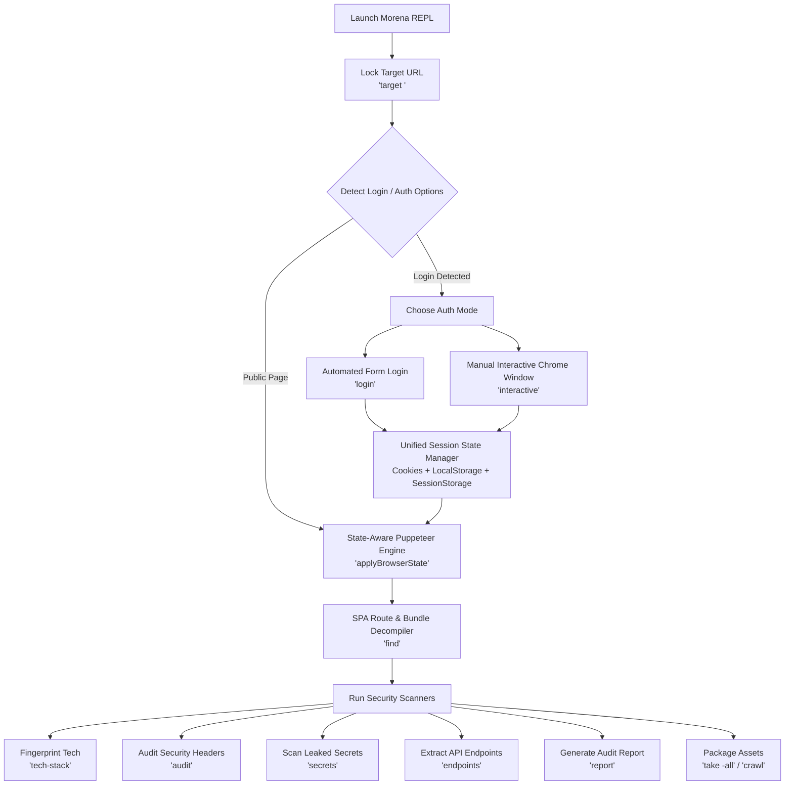

<div align="center">

```text
   ███╗   ███╗ ██████╗ ██████╗ ███████╗███╗   ██╗ █████╗ 
   ████╗ ████║██╔═══██╗██╔══██╗██╔════╝████╗  ██║██╔══██╗
   ██╔████╔██║██║   ██║██████╔╝█████╗  ██╔██╗ ██║███████║
   ██║╚██╔╝██║██║   ██║██╔══██╗██╔══╝  ██║╚██╗██║██╔══██║
   ██║ ╚═╝ ██║╚██████╔╝██║  ██║███████╗██║ ╚████║██║  ██║
   ╚═╝     ╚═╝ ╚═════╝ ╚═╝  ╚═╝╚══════╝╚═╝  ╚═══╝╚═╝  ╚═╝
```

# MORENA REPL

**Automated Client-Side Web Archiving, Security Reconnaissance & Asset Auditing Tool**

[](https://nodejs.org)
[](https://github.com/antoniusjairus4/Morena)
[](LICENSE)
[](https://pptr.dev)

*Morena is a stateful command-line REPL tool designed for authorized web asset auditing, DOM reconstruction, SPA route discovery, session state persistence, secret scanning, and security reporting.*

</div>

---

## ⚡ Features Overview

| Feature | Description |
| :--- | :--- |
| **🔒 Persistent Session Locking** | Lock onto a target host (`morena > target <url>`) with active session tracking. |
| **🔑 Unified Singleton Session State** | Captures and injects both **Cookies** and **Web Storage** (`localStorage` & `sessionStorage`) across all browser subroutines. |
| **🌐 Dual Authentication Modes** | Automated credential form login (`login`) & manual browser login (`interactive`) with full session capture. |
| **🔎 SPA Route & Bundle Discovery** | Scans DOM anchors, performance resources, inline scripts, and external JS bundles (`/assets/*.js`) to extract hidden SPA routes (`find`). |
| **🕷️ Smart Page Crawler** | Crawl specific routes by name or direct URL (`crawl /dashboard/transactions` or `crawl <url>`) with auto-route discovery. |
| **🔍 Tech Stack Fingerprinting** | Identify frameworks (React, Next, Vue, Svelte), UI libraries, CDNs, and web servers (`tech-stack`). |
| **🛡️ OWASP Header Auditor** | Evaluate target HTTP response headers (CSP, HSTS, CORS, Clickjacking flags) (`audit`). |
| **🔑 Secret & Token Scanner** | Scan JS bundles for leaked API keys, tokens, internal IPs & developer comments (`secrets`). |
| **🌐 API Route Extractor** | Extract hidden REST routes, endpoints, and WebSockets from JavaScript assets (`endpoints`). |
| **📄 Security Report Generator** | Export structured HTML security audit reports directly to `~/Downloads` (`report`). |
| **🌳 Hierarchical ASCII Tree** | Visualize captured DOM & asset structures in tree format (`show`). |
| **📦 Automatic ZIP Archiving** | Reconstructs offline-compatible HTML/CSS/JS/images directly to `~/Downloads` (`take`, `take -all`). |
| **⚡ Bright Data Collector** | Trigger Bright Data Data Collector cloud scrapers (`collector trigger`, `collector config`). |

---

## 🏗️ Architecture Workflow



---

## 💻 Step-by-Step Installation Guide for all OS

### 🐧 1. Linux (Kali Linux, Ubuntu, Debian, Arch)

```bash
# Step 1: Open your Linux terminal & update packages
sudo apt update && sudo apt install -y git nodejs npm

# Step 2: Clone the Morena repository
git clone https://github.com/antoniusjairus4/Morena.git
cd Morena

# Step 3: Install project dependencies
PUPPETEER_SKIP_DOWNLOAD=true npm install

# Step 4: Link globally for system-wide access
sudo npm link

# Step 5: Launch Morena from anywhere!
morena
```

---

### 🍎 2. macOS (Apple Silicon M1/M2/M3 & Intel)

```bash
# Step 1: Open Terminal and ensure Node.js & Git are installed (via Homebrew)
brew install node git

# Step 2: Clone the repository
git clone https://github.com/antoniusjairus4/Morena.git
cd Morena

# Step 3: Install project dependencies
npm install

# Step 4: Link executable globally
sudo npm link

# Step 5: Start Morena REPL
morena
```

---

### 🪟 3. Windows (PowerShell, Command Prompt, or WSL)

```powershell
# Clone the repository
git clone https://github.com/antoniusjairus4/Morena.git
cd Morena

# Install project dependencies
npm install

# Link globally (Run PowerShell as Admin)
npm link

# Launch Morena
morena
```

---

## 🚀 Interactive REPL Command Reference

| Command | Usage Example | Description |
| :--- | :--- | :--- |
| `target` | `target palindrome.antoniusjairus.in` | Lock target host and start session timer |
| `login` | `login` | Automated form login (prompts for username & password) |
| `interactive` | `interactive` | Opens visible Chrome window for manual browser login & full storage capture |
| `find` | `find` | Discovers all internal routes (`/dashboard`, `/profile`, etc.) from DOM & JS bundles |
| `crawl` | `crawl dashboard` or `crawl /dashboard/transactions` | Scrapes a specific route, path, or direct URL with auto-route discovery |
| `take` | `take` | Scrapes target DOM + assets; triggers interactive page selector |
| `take -all` | `take -all` | Scrapes current page AND all discovered routes into one ZIP archive |
| `tech-stack` | `tech-stack` | Fingerprints frameworks (React, Next, Vue), UI libs, CDNs, & web servers |
| `secrets` | `secrets` | Scans JS assets for leaked API keys, tokens & developer comments |
| `endpoints` | `endpoints` | Extracts hidden REST API routes & WebSockets from JS bundles |
| `audit` | `audit` | Audits response headers against OWASP guidelines (CSP, CORS, HSTS) |
| `report` | `report` | Generates formatted HTML security audit report in `~/Downloads` |
| `collector config` | `collector config <token> <collector_id>` | Configure default Bright Data API token & collector ID for session |
| `collector trigger` | `collector trigger [collector_id] [url]` | Triggers Bright Data Data Collector DCA job via API |
| `show` | `show` | Renders a hierarchical ASCII file tree of scraped assets |
| `session -time`| `session -time` | Displays elapsed session duration since target lock |
| `info` | `info` | Displays formatted session status card |
| `headers` | `headers` | Fetches target HTTP response headers |
| `status` | `status` | Pings target URL and reports HTTP status and latency |
| `clean` | `clean` | Deletes temporary staging files and caches |
| `history` | `history` | Displays list of commands executed in current session |
| `exit-now` | `exit-now` | Cleans staging directories and exits Morena cleanly |

---

## 📖 Security Audit Execution Example

```text
morena > target palindrome.antoniusjairus.in
[+] Target identified and locked: https://palindrome.antoniusjairus.in/

morena > interactive
[*] Opening browser window... Log in manually, then press ENTER here.
[+] Session state captured successfully (0 cookies, 8 storage items).

morena > find
Scanning target for internal routes and links...
✔ Discovered 15 internal route(s)
  1. /dashboard → https://palindrome.antoniusjairus.in/dashboard
  2. /dashboard/transactions → https://palindrome.antoniusjairus.in/dashboard/transactions
  3. /dashboard/splits → https://palindrome.antoniusjairus.in/dashboard/splits
  4. /dashboard/assets → https://palindrome.antoniusjairus.in/dashboard/assets
  ...

morena > crawl /dashboard/transactions
Crawling /dashboard/transactions...
✔ Crawled /dashboard/transactions — 6 file(s) captured
[+] Archive generated: ~/Downloads/morena-crawl-dashboard-transactions.zip

morena > tech-stack
Technology Stack Fingerprints for https://palindrome.antoniusjairus.in/:
  Frameworks:       React.js, Next.js, Vite
  UI Libraries:     Tailwind CSS
  Server Headers:   Server: Vercel

morena > audit
OWASP Security Headers Audit for https://palindrome.antoniusjairus.in/:
 [FAIL] Content-Security-Policy: Missing
         ➜ Implement CSP to mitigate XSS and data injection attacks.
 [PASS] Strict-Transport-Security: max-age=31536000; includeSubDomains
         ➜ HSTS is enabled.
 [WARN] X-Frame-Options: Missing
         ➜ Set X-Frame-Options to DENY or SAMEORIGIN to prevent Clickjacking.

morena > report
✔ Security audit report generated!
Location: /home/jairus/Downloads/morena-report-2026-08-10.html
```

---

## 🛡️ Legal & Security Notice

> [!WARNING]
> **AUTHORIZATION REQUIRED:** This tool is strictly designed for authorized security reconnaissance, frontend asset auditing, and web archiving. Ensure you have explicit written permission from target owners before performing assessments.
