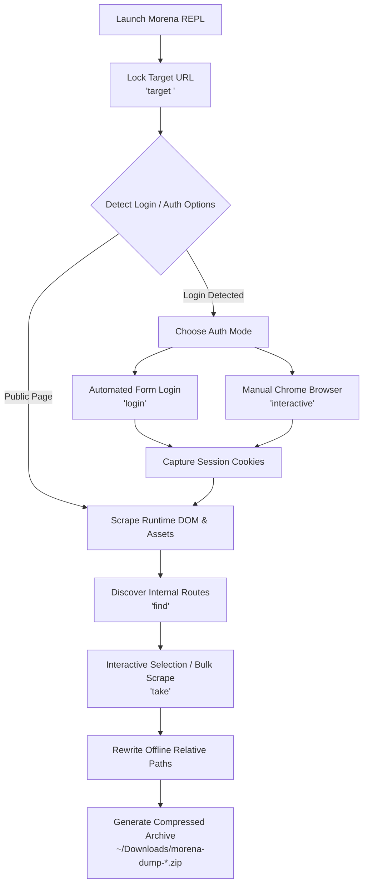

<div align="center">

```text
   ███╗   ███╗ ██████╗ ██████╗ ███████╗███╗   ██╗ █████╗ 
   ████╗ ████║██╔═══██╗██╔══██╗██╔════╝████╗  ██║██╔══██╗
   ██╔████╔██║██║   ██║██████╔╝█████╗  ██╔██╗ ██║███████║
   ██║╚██╔╝██║██║   ██║██╔══██╗██╔══╝  ██║╚██╗██║██╔══██║
   ██║ ╚═╝ ██║╚██████╔╝██║  ██║███████╗██║ ╚████║██║  ██║
   ╚═╝     ╚═╝ ╚═════╝ ╚═╝  ╚═╝╚══════╝╚═╝  ╚═══╝╚═╝  ╚═╝
```

# MORENA REPL

**Automated Client-Side Web Archiving, Security Reconnaissance & Asset Auditing Tool**

[](https://nodejs.org)
[](https://github.com/antoniusjairus4/Morena)
[](LICENSE)
[](https://pptr.dev)

*Morena is a stateful command-line REPL tool designed for authorized web asset auditing, DOM reconstruction, route discovery, and offline package creation.*

</div>

---

## ⚡ Features Overview

| Feature | Description |
| :--- | :--- |
| **🔒 Persistent Session Locking** | Lock onto a target host (`morena > target <url>`) and maintain active session timers. |
| **🔑 Dual Authentication Modes** | Automated form credential login (`login`) & manual browser login (`interactive`) with automatic session cookie capture. |
| **🔎 Route & Link Discovery** | Discover all same-origin internal routes on any web application (`find`). |
| **🕷️ Deep Route Crawling** | Crawl specific discovered pages (`crawl <page>`) or bulk scrape all routes (`take -all`). |
| **🎯 Interactive Page Selector** | Radio-button navigation with arrow keys to choose which pages to scrape during `take`. |
| **🌳 Hierarchical ASCII Tree** | Visualize captured DOM & asset structures in tree format (`show`). |
| **📦 Automatic ZIP Archiving** | Reconstructs offline-compatible HTML/CSS/JS/images directly to `~/Downloads`. |

---

## 🏗️ Architecture Workflow



---

## 💻 Step-by-Step Installation Guide

### 🐧 1. Linux (Kali Linux, Ubuntu, Debian, Arch)

```bash
# Step 1: Open your Linux terminal & update packages
sudo apt update && sudo apt install -y git nodejs npm

# Step 2: Clone the Morena repository
git clone https://github.com/antoniusjairus4/Morena.git
cd Morena

# Step 3: Install project dependencies
PUPPETEER_SKIP_DOWNLOAD=true npm install

# Step 4: Link globally for system-wide access
sudo npm link

# Step 5: Launch Morena from anywhere!
morena
```

*Note for Kali Linux Users: If you prefer shell alias over `sudo npm link`:*
```bash
echo "alias morena='node /home/jairus/morena/src/index.js'" >> ~/.zshrc
source ~/.zshrc
```

---

### 🍎 2. macOS (Apple Silicon M1/M2/M3 & Intel)

```bash
# Step 1: Open Terminal and ensure Node.js & Git are installed (via Homebrew)
brew install node git

# Step 2: Clone the repository
git clone https://github.com/antoniusjairus4/Morena.git
cd Morena

# Step 3: Install project dependencies
npm install

# Step 4: Link executable globally
sudo npm link

# Step 5: Start Morena REPL
morena
```

---

### 🪟 3. Windows (PowerShell, Command Prompt, or WSL)

#### Option A: Native Windows (PowerShell / CMD)
1. Install [Node.js (LTS version)](https://nodejs.org/) and [Git for Windows](https://git-scm.com/).
2. Open **PowerShell as Administrator** and run:

```powershell
# Clone the repository
git clone https://github.com/antoniusjairus4/Morena.git
cd Morena

# Install project dependencies
npm install

# Link globally (Run PowerShell as Admin)
npm link

# Launch Morena
morena
```

#### Option B: Windows Subsystem for Linux (WSL)
```bash
git clone https://github.com/antoniusjairus4/Morena.git
cd Morena
PUPPETEER_SKIP_DOWNLOAD=true npm install
sudo npm link
morena
```

---

## 🚀 Interactive REPL Command Reference

Once launched (`morena`), use the following interactive commands:

| Command | Usage Example | Description |
| :--- | :--- | :--- |
| `target` | `target palindrome.antoniusjairus.in` | Lock target host and start session timer |
| `login` | `login` | Automated form login (prompts for username & password) |
| `interactive` | `interactive` | Opens visible Chrome window for manual browser login |
| `find` | `find` | Discovers all internal routes (`/dashboard`, `/profile`, etc.) |
| `crawl` | `crawl dashboard` | Scrapes a specific discovered route |
| `take` | `take` | Scrapes target DOM + assets; triggers page selector if routes exist |
| `take -all` | `take -all` | Scrapes current page AND all discovered routes into one ZIP |
| `show` | `show` | Renders a hierarchical ASCII file tree of scraped assets |
| `scession -time`| `scession -time` | Displays elapsed session duration since target lock |
| `info` | `info` | Displays formatted session status card |
| `headers` | `headers` | Fetches target HTTP response headers |
| `status` | `status` | Pings target URL and reports HTTP status and latency |
| `set-timeout` | `set-timeout 45` | Updates Puppeteer page load timeout limit (seconds) |
| `clean` | `clean` | Deletes temporary staging files and caches |
| `history` | `history` | Displays list of commands executed in session |
| `exit-now` | `exit-now` | Cleans staging directories and exits Morena cleanly |

---

## 📖 Usage Example

```text
morena > target palindrome.antoniusjairus.in
[+] Target identified and locked: https://palindrome.antoniusjairus.in/

morena > find
[+] Discovered 5 internal route(s)
  1. /dashboard → https://palindrome.antoniusjairus.in/dashboard
  2. /profile   → https://palindrome.antoniusjairus.in/profile

morena > take
[!] Login form / authentication option detected on target page!
? A login form was detected. How would you like to proceed?
  ● Log in manually (interactive browser window), then scrape fully

[*] Opening browser window... Log in manually, then type 'continue' here.
Type 'continue' when you have logged in: continue
[+] Session captured from browser. 8 cookies stored.

✔ Scraped final runtime DOM from https://palindrome.antoniusjairus.in/
✔ Downloaded 12 frontend asset dependencies

Default destination: /home/jairus/Downloads/morena-dump-2026-08-05.zip
✔ Packaging complete! Archive successfully generated.

morena > show
Hierarchical Asset Tree for https://palindrome.antoniusjairus.in/:
/ (scraped root)
├── index.html
└── assets/
    ├── css/
    │   └── style.css
    └── js/
        └── app.js
```

---

## 🛡️ Legal & Security Notice

> [!WARNING]
> **AUTHORIZATION REQUIRED:** This tool is strictly designed for authorized security reconnaissance, frontend asset auditing, and web archiving. Ensure you have explicit written permission from target owners before performing assessments.